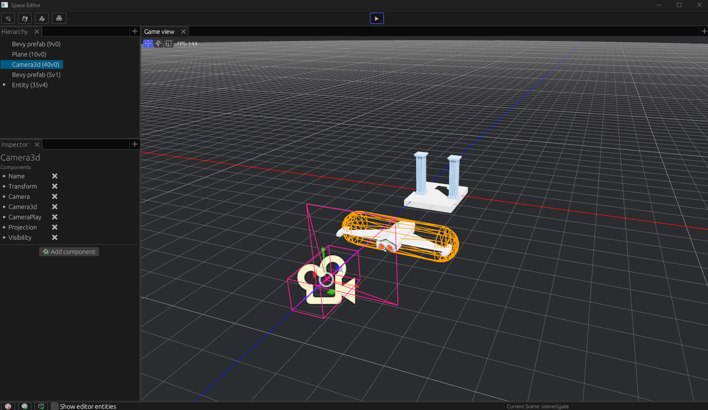

# space_editor: The Bevy Prefab Editor
License: MIT 

### Editor in Edit Mode


### Editor in Play Mode


space_editor is useful tool for scene/prefab/prototyping with bevy engine.  Its allow to create/modify levels/scenes/prefabs in fast gui based way.

## Project goal

Aspires to be editor for bevy while there is no official editor.

## Core Team

* Project Lead:         rewin <rewin1996@gmail.com>
* Developer Experience: Julia Naomi <jnboeira@outlook.com>
* UX Designer:          Jay Kim <jaykim9419@gmail.com>

## Main features

- **Intuitive Scene and Prefab Management**: Space Editor allows you to prepare and save scenes and prefabs with an intuitive user interface. You can easily reuse them in your game development workflow. 
- **bevy_xpbd_3d compatibility**: Space Editor supports bevy_xpbd_3d, including all editor features. (bevy_xpbd_2d not supported)
- **Gizmo-Based manipulations**: Manipulate entity positions, rotations, and scales using gizmos. 
- **Component values editing**: Easily edit component parameters within the editor UI 
- **Seamless Editor-Game switching**: Switch between the editor UI and the game effortlessly for fast prototyping and testing. 
- **Prefab Reusability**: Prefabs can be nested within other prefabs, improving reusability and organization in your projects. 
- **Many custom components**: Space Editor implements various custom components to seamlessly integrate its saving system with the standard Bevy scene format. 
- **Easy API for customization**: Customize or register your own components within the editor with ease, tailoring it to your specific project needs.
- **Event dispatching**: Send custom events directly from the editor UI for easier gameplay debugging.  
- **API for adding tabs**: Extend the functionality of the editor by easily adding new tabs, enhancing your workflow. 

Getting Started
To run the editor, use the following command:
> cargo run

To run platformer example, use the following command:
> cargo run run --example platformer --features bevy_xpbd_3d

## Usage - Game

The following explains how to integrate `space_editor` as a game plugin to use the created prefabs in your game.

### Cargo

Add this line to your Cargo.toml file
```toml
space_editor = "0.4.0"

# For now it is recomendended to use the following patches of the libraries we are using
[patch.crates-io]
egui-gizmo = { git = "https://github.com/naomijub/egui-gizmo.git" }
bevy-inspector-egui ={ git = "https://github.com/naomijub/bevy-inspector-egui.git" }
```

### Prefab spawn system
To utilize the prefab spawn system, simply add the plugin to your application as follows:
```rs
App::default()
    .add_plugins(DefaultPlugins)
    .add_plugins(PrefabPlugin)
```

For spawning, use the PrefabBundle:
```rs
 commands.spawn(PrefabBundle::new("tile.scn.ron"))
        .insert(Name::new("Prefab"));
```

(More code at examples/spawn_prefab.rs)


## Usage - Editor
The editor is a ready to use executable that can be used and altered at your own necessity. It's base configuration is as follows, with `simple_editor_setup`:

```rs
fn main() {
    App::default()
        .add_plugins(DefaultPlugins)
        .add_plugins(SpaceEditorPlugin::default())
        .add_systems(Startup, simple_editor_setup)
        .run();
}
```

(Code from main.rs)

### Editor usage strategy

* Fork this repo.
* Create a branch to keep up to date with project updates and addressed bugs.
* Editor is executed with `editor` feature.
* Feel free to upstream your examples and community modules to enrich space-editor

## Customization

**More detailed information in docs/README.md**

Custom types can be added to the editor gui and prefab spawn system with just a single line:

```rs
use editor::prelude::EditorRegistryExt;

app.editor_registry::<Name>();
```

The representation of components in the editor UI can also be customized by bevy_inspector_egui library.

### Events

Custom Events can be added to the editor UI with the following:

```rs
#[derive(Event, Default, Resource, Reflect, Clone)]
#[reflect(Resource)]
pub struct Name;

use editor::prelude::EditorRegistryExt;

app.editor_registry_event::<Name>();
```

One limitation is that events must implement `Event, Default, Resource, Reflect, Clone`, with `Resource` reflected. Once registered, events can be sent using the `Event Dispatcher` tab.

> Obs: editor already handles internally objects registration and initialization:
> 
> `register_type::<T>() and init_resource::<T>()`

> To disable this, use feature `no_event_registration`.

### Prefab
A prefab is simply a Bevy scene serialized to a readable and editable RON format. However, it needs to be spawned through PrefabBundle to activate custom logic such as adding global transforms to an object.

> More documentation can be found at the [docs folder](docs/README.md)

## 2D Mode support

SpaceEditor can handle most 2D bevy elements, such as 2D Camera, 2D meshes and Sprites. 

Game mode can be changed between 3D and 2D in `settings > GameMode`. This changes the editor camera configuration.


## More Documentation on
- [Extended Documentation](docs/README.md)
- [Shortcuts/Hotkeys Configuration](docs/shortcuts.md)

|bevy|space_editor crates|
|---|---|
|0.12| 0.3 - 0.4|

### Contributing
Any request for adding functionality to the editor is welcome. Open an issue on the [issue tracker](https://github.com/rewin123/space_editor/issues).
Any pull request is welcome too:) 

### License
MIT - https://choosealicense.com/licenses/mit/


### Project naming

I'm using the editor to create my own Sci-Fi space game, so the name of the project starts with space_ :)

